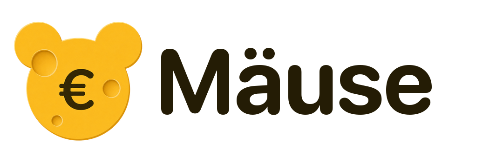
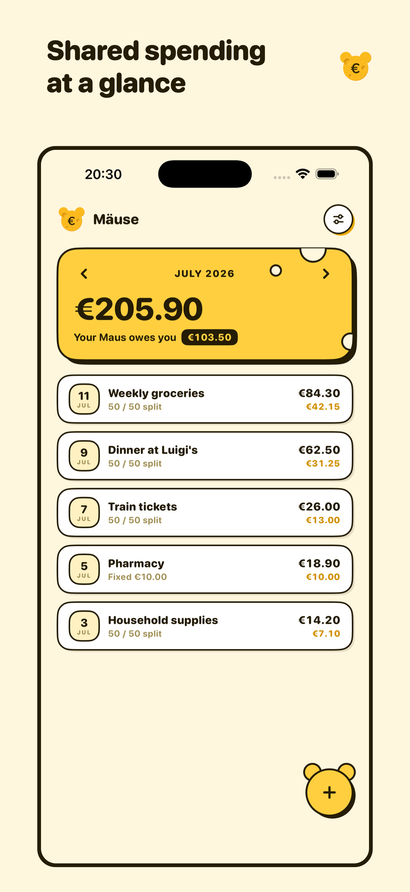
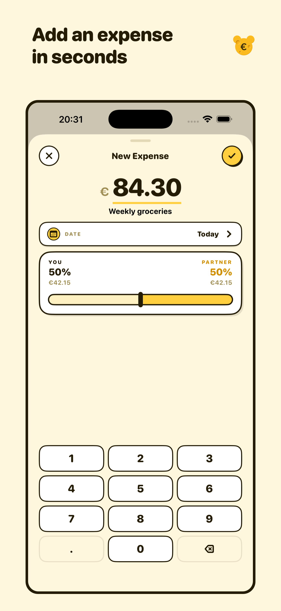
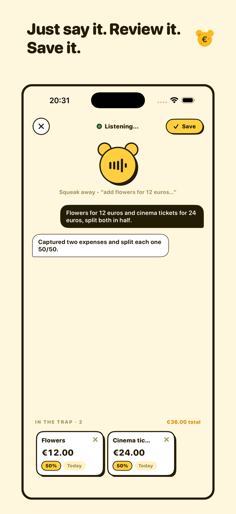
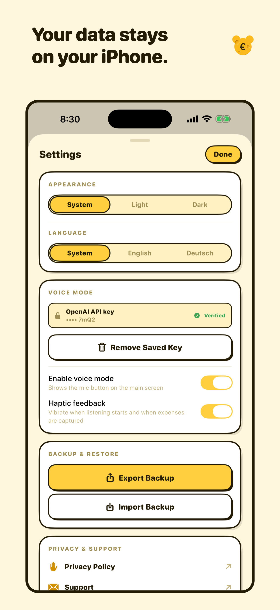

<p align="center">
  <picture>
    <source media="(prefers-color-scheme: dark)" srcset="Maeuse/BrandAssets/MaeuseLogoLockupDark.png">
    
  </picture>
</p>

<p align="center">
  Shared expenses, made simple. A local-first iPhone app for two people who want to keep everyday spending fair without maintaining a spreadsheet.
</p>

## Current release

| | |
| --- | --- |
| Version | 1.2.1 (build 16) |
| Platform | iPhone · iOS 17 or later |
| Status | Internal TestFlight · 1.2.0 approved on the App Store |
| Languages | English and German |

Version 1.2.1 (build 18) adds Lock Screen, Home Screen, and Control Center expense capture, improves the control icons and expense deletion experience, and adds Voice Mode haptic feedback. It ships via Internal TestFlight. Version 1.2.0 was approved earlier; App Store publishing remains manual.

## What Mäuse does

- Records shared expenses in seconds.
- Splits costs by percentage or by an exact partner amount.
- Shows monthly spending, partner shares, and the current balance at a glance.
- Keeps expense data on the iPhone with SwiftData.
- Exports and restores portable JSON backups.
- Supports English and German, plus light, dark, and system appearance.
- Optionally turns several spoken expenses into reviewable drafts with Voice Mode.

<p align="center">
  
  
  
  
</p>

## Local-first by design

Mäuse has no account system, app backend, advertising, or tracking SDK. Expenses are stored locally and manual entry works offline. Backup files are created only when the user exports them.

Voice Mode is optional. When a user enables it and starts a session, microphone audio and expense context are sent directly to OpenAI. The user supplies their own compatible OpenAI API key, which Mäuse stores in iOS Keychain. Drafts can be reviewed, corrected, or removed before anything is saved.

## Technology

- SwiftUI for the interface
- SwiftData for local persistence
- Observation for application state
- AVFoundation for microphone capture
- URLSession WebSocket for OpenAI Realtime sessions
- XCTest for unit coverage

The Xcode project is intentionally dependency-light and does not require a package manager or third-party SDK to build.

## Development

Requirements:

- macOS with Xcode 26 or later recommended
- iOS 17 or later simulator or device
- An Apple development team for installation on a physical device
- Optional: an OpenAI API project with access to `gpt-realtime-2` for Voice Mode

Clone the repository, open `Maeuse.xcodeproj`, select the `Maeuse` scheme, and run it on an iPhone simulator or device. Manual expense tracking works without additional configuration.

To run the test suite from the command line:

```sh
DEVELOPER_DIR=/Applications/Xcode.app/Contents/Developer \
  xcodebuild test \
  -project Maeuse.xcodeproj \
  -scheme Maeuse \
  -destination 'platform=iOS Simulator,name=iPhone 17 Pro'
```

## Versioning and releases

The Xcode project is the source of truth for both version values:

- `MARKETING_VERSION` is the user-facing version (`1.2.0`).
- `CURRENT_PROJECT_VERSION` is the App Store Connect build number (`9`).

Use `scripts/bump-version.sh` before creating a new archive. See [RELEASING.md](RELEASING.md) for the full release workflow and [CHANGELOG.md](CHANGELOG.md) for user-facing release notes.

## Repository guide

- `Maeuse/` — application source, resources, and privacy manifest
- `MaeuseTests/` — unit tests
- `AppStore/` — localized listing copy, screenshots, compliance notes, and submission checklist
- `scripts/` — versioning and screenshot helpers

Product information and support are available at [mäuse.app](https://xn--muse-loa.app/).

## License

No open-source license has been selected. All rights are reserved by the repository owner.
