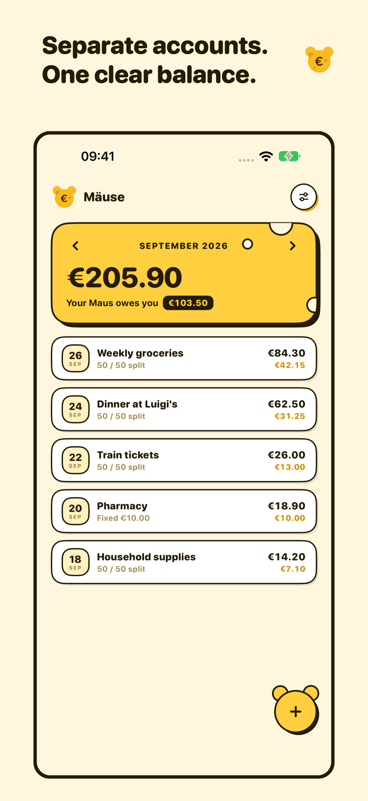
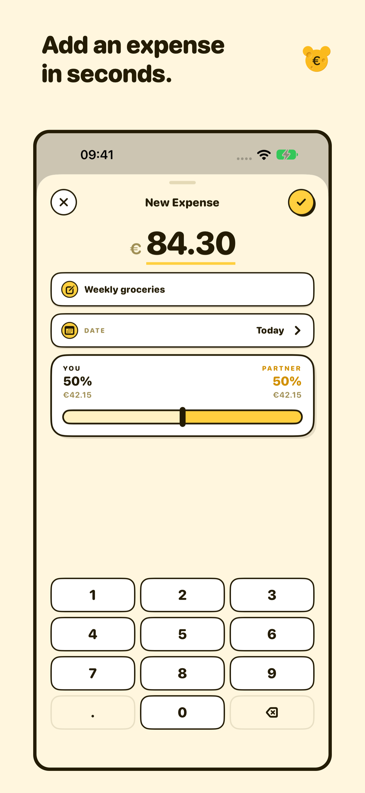
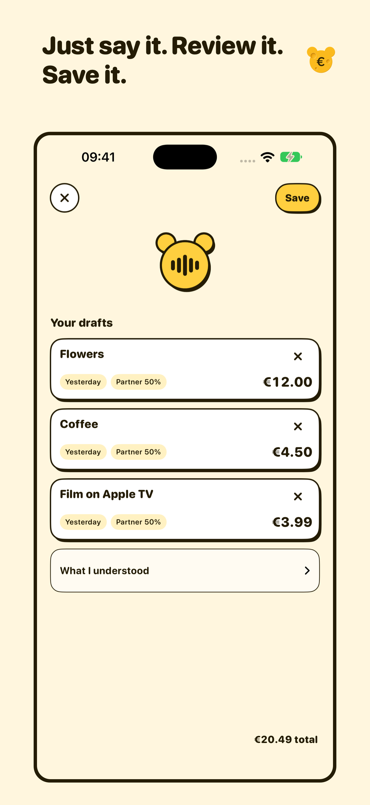
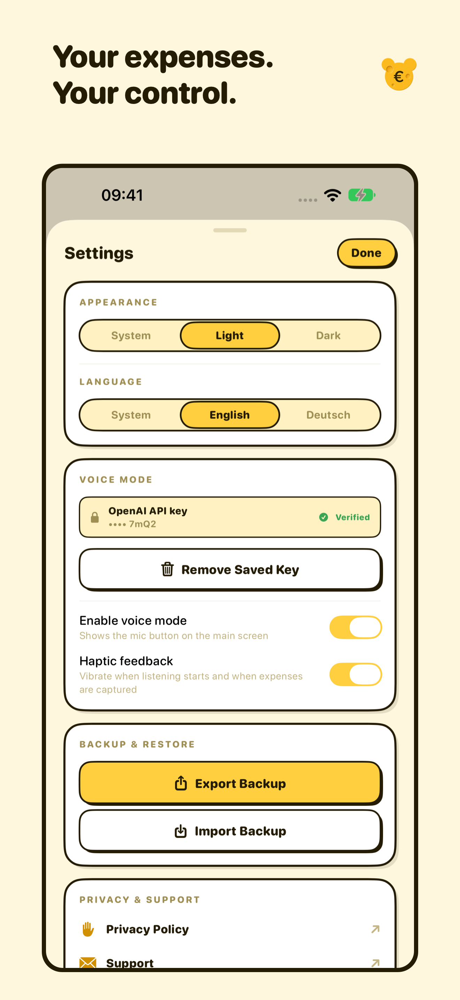

<p align="center">
  <picture>
    <source media="(prefers-color-scheme: dark)" srcset="Maeuse/BrandAssets/MaeuseLogoLockupDark.png">
    
  </picture>
</p>

<p align="center">
  The expense tracker for couples. A local-first iPhone app for two people who share everyday costs without sharing a bank account.
</p>

## Current release

| | |
| --- | --- |
| Version | 1.5.0 (build 55) |
| Platform | iPhone · iOS 17 or later |
| Status | Internal TestFlight candidate; 1.4.0 (48) remains in App Review |
| Languages | English and German |

Version 1.5.0 adds **Apple · On device** to Voice Mode: local Apple speech recognition and Foundation Models, with no API key, usage fees, or cloud fallback. Choose a provider in Settings before enabling Voice Mode. Apple mode requires iOS 26+, a compatible iPhone, enabled Apple Intelligence, and downloaded model/language resources.

Build 51 gives Apple mode one microphone control and automatically processes phrases after quiet speech pauses. The microphone visibly pauses during processing and resumes afterward unless you chose to pause. Draft cards, total, and Save stay familiar; transcript details are collapsed. Save during recording first finishes the phrase for review, then a second Save commits reviewed drafts. The build 50 false-interruption fix is retained. Offline speech, endpoint timing, and Apple model inference still need verification on an eligible physical iPhone.

Build 55 replaces free Apple model tool calls with a structured action plan. The app owns dates, money arithmetic, identities and 50/50 defaults; recognized unassigned ratios require clarification. Two real Apple-model runs passed all 26 checks, and 110 simulator tests passed. Physical iPhone audio/model behavior remains the final tester check.

Build 54 replaces the Apple waveform with a stable microphone and slow accent halo during actual capture. Reduced Motion keeps the halo steady; paused/processing states remain distinct.

Build 53 refines intentional microphone stops and settles the endpoint ring before showing it; resumed speech fades the ring rather than rewinding it.

Build 52 makes the microphone's motion reflect real capture, audio, and the speech-pause timer, with a crossed-out microphone while processing and a visible pause/play choice for what happens afterward. Reduced Motion and VoiceOver retain clear state and control feedback. OpenAI capture is unchanged.

Version 1.4.0 brings GPT-Realtime-2.1 voice capture without separate transcription charges, a redesigned Voice Mode with compact drafts and request history, and iOS 27 layout and reliability improvements. It contains the same app behavior as user-tested build 47. All 64 iOS 27 tests passed again for candidate build 48, as did the Release build and static analysis with no warnings. Distribution is tracked in `AppStore/submission-checklist.md`. The approved copy and screenshots were submitted with build 48 on September 27, 2026. Apple confirms Waiting for Review; Manual Release is enabled.

Latest App Store release (build 32): Lock Screen, Home Screen, and Control Center capture, improved control icons and expense deletion, Voice Mode haptics, and a more stable expense editor with the keyboard open.

## What Mäuse does

- Records shared expenses in seconds.
- Splits costs by percentage or by an exact partner amount.
- Shows monthly spending, partner shares, and the current balance at a glance.
- Keeps expense data on the iPhone with SwiftData.
- Exports and restores portable JSON backups.
- Supports English and German, plus light, dark, and system appearance.
- Optionally turns several spoken expenses into reviewable drafts with Voice Mode.

<p align="center">
  
  
  
  
</p>

## Local-first by design

Mäuse has no account system, app backend, advertising, or tracking SDK. Expenses are stored locally and manual entry works offline. Backup files are created only when the user exports them.

Voice Mode is optional. Choose **Apple · On device** or **OpenAI · Cloud** in Settings, review the provider-specific disclosure, and enable it. Switching providers or disabling voice requires fresh consent. Existing cloud users keep their chosen provider; new installations start with Apple selected and voice disabled.

| | Apple · On device | OpenAI · Cloud |
| --- | --- | --- |
| Processing | On-device speech recognition and Apple Foundation Models; never OpenAI | Audio and expense context sent to OpenAI |
| Cost | Free; no API key or per-request charge | Your own OpenAI API key and usage billing |
| Internet | Only needed to download Apple resources initially | Required for capture |
| Experience | Dictate, tap **Process phrase**, review, then **Record more**; up to 50 seconds per turn and 10 drafts per session | Continuous capture with automatic turn detection and more flexible requests |
| Availability | iOS 26+, Apple Intelligence compatible device, enabled Intelligence, downloaded speech/model resources in the app language | Any supported iPhone with a compatible API key |

Local mode checks availability at setup and before each recording. It stops with an explanation if unavailable; it never switches providers. Audio is not saved by Mäuse, and transcripts/context stay in memory until the session closes. The model identifies expense details; the app resolves quoted prices, shares, and dates deterministically and validates them before creating reviewable drafts. Short, clear phrases work best; unsupported date phrases may require a simpler date or manual entry. Review every draft before saving.

The OpenAI option uses `gpt-realtime-2.1` to interpret audio and create expense drafts in one session, without a separate transcription model. Drafts appear in a compact vertical list and stay in place when corrected. Expand **What I understood** to review the session’s requests and corrections in chronological order. The collapsed section shows only its title; expanding it opens directly into the entries. Save uses a static label, and the footer shows only the total. Entries preserve natural phrasing where understood, remain unchanged as drafts evolve, and clear when the session ends. This is an interpretation history, not a word-for-word transcript; clarification questions appear separately when needed.

The voice connection indicator starts as a cheese wheel with orbiting crumbs, then transforms into the mouse when microphone capture is ready. Its bars gently wave in silence and react more strongly to microphone input, using a decibel-based display range so normal speech is clearly visible. After each spoken request, three cheese crumbs orbit inside the mouse until the result is applied. Speaking while a result is pending restores the live bars and moves the crumbs to the rim. New drafts slide in without empty placeholders, and corrections briefly highlight the changed fields. Reduce Motion disables the idle wave, shows stationary processing crumbs, and replaces the connection orbit and transformation with a short crossfade; connection errors still appear as readable text.

## Technology

- SwiftUI for the interface
- SwiftData for local persistence
- Observation for application state
- AVFoundation for microphone capture
- URLSession WebSocket for OpenAI Realtime sessions
- XCTest for unit coverage

The Xcode project is intentionally dependency-light and does not require a package manager or third-party SDK to build.

## Development

Requirements:

- macOS with Xcode 27 recommended
- iOS 17 or later simulator or device
- An Apple development team for installation on a physical device
- Optional: an OpenAI API project with access to `gpt-realtime-2.1` for Voice Mode

Clone the repository, open `Maeuse.xcodeproj`, select the `Maeuse` scheme, and run it on an iPhone simulator or device. Manual expense tracking works without additional configuration.

To run the test suite from the command line:

```sh
DEVELOPER_DIR=/Applications/Xcode.app/Contents/Developer \
  xcodebuild test \
  -project Maeuse.xcodeproj \
  -scheme Maeuse \
  -destination 'platform=iOS Simulator,name=iPhone 17 Pro'
```

## Versioning and releases

The Xcode project is the source of truth for both version values:

- `MARKETING_VERSION` is the user-facing version (`1.5.0`).
- `CURRENT_PROJECT_VERSION` is the App Store Connect build number (`49`).

Use `scripts/bump-version.sh` before creating a new archive. See [RELEASING.md](RELEASING.md) for the full release workflow and [CHANGELOG.md](CHANGELOG.md) for user-facing release notes.

## Repository guide

- `Maeuse/` - application source, resources, and privacy manifest
- `MaeuseTests/` - unit tests
- `AppStore/` - localized listing copy, screenshots, compliance notes, and submission checklist
- `scripts/` - versioning and screenshot helpers

Learn more at [mäuse.app](https://xn--muse-loa.app/).

## License

MIT License. See [LICENSE](LICENSE).
